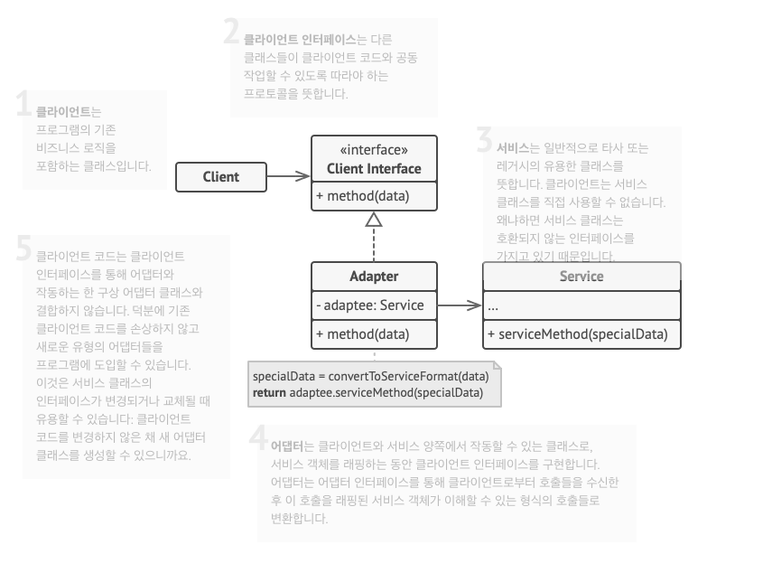

## 어댑터 패턴
### 개요
- 호환되지 않는 인터페이스를 가진 객체들이 협업할 수 있도록 하는 구조적 디자인 패턴
### 문제
- 앱이 XML 형식의 데이터로만 운영되는데, 이 앱을 활용하여 JSON 데이터로도 운영되어야 할 경우
### 해결책
- 어댑터를 제공
  - 한 객체의 인터페이스를 다른 객체가 이해할 수 있도록 변환하는 객체
  - 1. 어댑터는 기존에 있던 객체 중 하나와 호왼되는 인터페이스르 받음
    2. 이 인터페이스를 사용 시 기존 객체는 어댑터의 메서드를 안전하게 호출 가능
    3. 새 객체에서 호출을 받으면 해당 객체가 예상하는 형식과 순서대로 전달
  - 위 경우는 XML->JSON 변환 어댑터를 만들고, 어댑터가 호출을 받으면 분석 객체의 적절한 메서드를 전달

### 적용
- 기존 클래스를 사용하고 싶지만, 인터페이스가 나머지 코드와 호환되지 않을 때
- 부모 클래스에 추가할 수 없는 공통 기능들이 없는, 여러 기존 자식 클래스들을 재사용하려는 경우