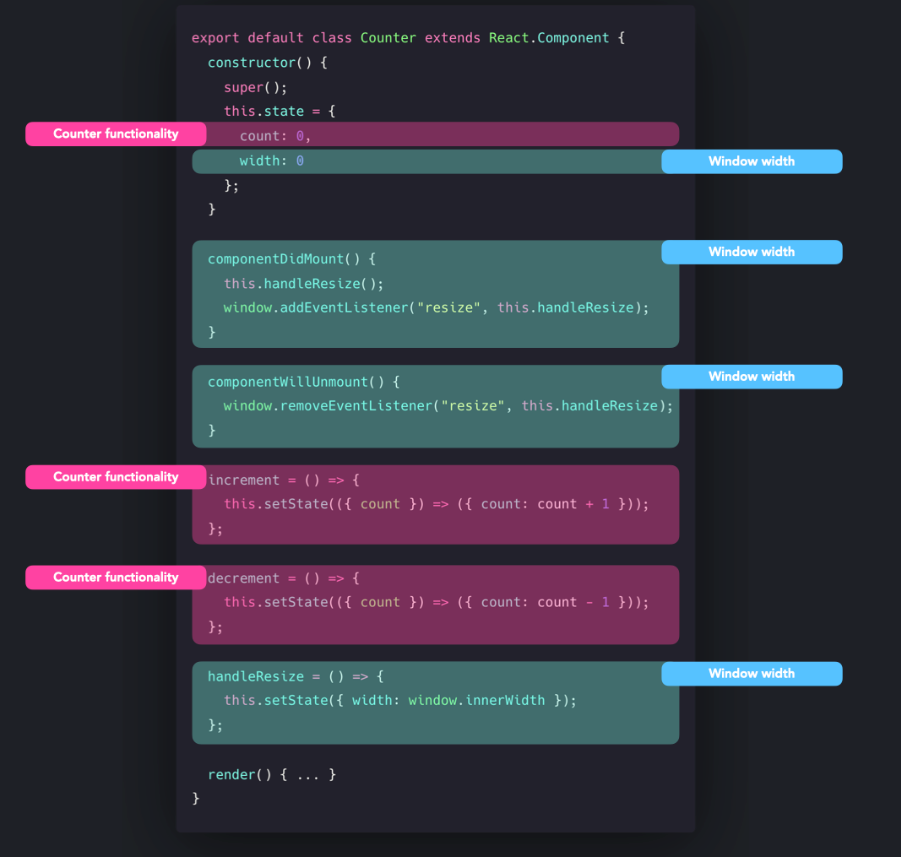
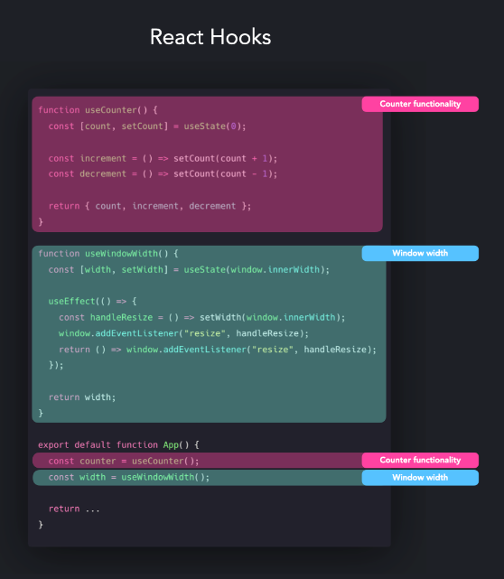

## hooks
### 개요
- hooks는 state와 lifecycle method를 class component 사용 없이 가능하게 함
### Class Component
- hook이 소개되기 전에 state와 life cycle를 쓰기 위해서 class component를 사용해야 했음
- 클래스 컴포넌트를 사용하는 거는 단점이 있음
    - 작은 역할을 하는 컴포넌트여도 코드의 라인수가 너무 길어짐
    - bind, constructor, this ... 키워드를 이해해야 함
### Restructuring
- HOC / Render props 패턴을 이용하여 재사용 가능
- wrapping을 너무 많이 하게 됨
### Complexity
- 로직이 얽히게 됨

- counter와 window width가 얽혀있음
### Hooks
- 위의 단점으로 hooks가 개발됨
- functional component에 상태 추가 가능
- lifecycle method없이 컴포넌트의 life cycle 관리 가능
- state hook, effect hook, custom hooks ... etc

- 로직 분리 가능
### 장점
- 복잡성이 적음
- 로직 재사용 가능
### 단점
- useOOO와 같은 룰이 있음
- useEffect처럼 시기적절하게 사용해야 하는 훅이있음