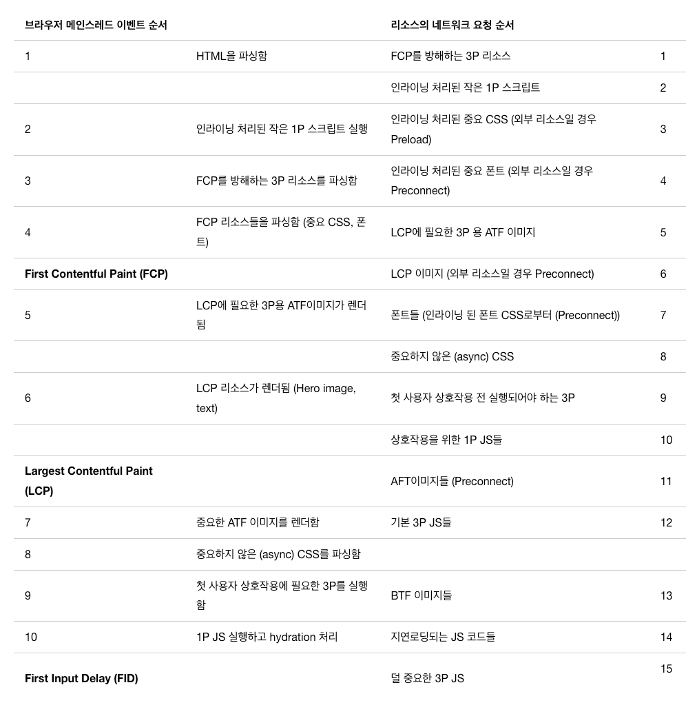

## 리소스별 제약사항 및 우선순위
### 중요CSS
- fcp에 필요한 최소 css
- html자체에 인라인으로 포함되어야 함
### 폰트
- 인라인으로 처리되어야함
- 인라인이 어려우면 preconnect로 처리해서 로드
### ATF 이미지
- hero image가 하나의 예시
- 크기를 명시해야 함
  - 명시하지 앟으면 렌더링될 때 레이아웃 변경이 일어날 수 있음
### BTF 이미지
- 페이지 로드 직후 뷰포트에 보여지는 이미지
- lazyloading 적용대상
- 1p js나 중요한 3p js가 로드되는걸 방해하지 않아야 함
### 1p js
- 앱의 상호작용이 준비되는 것
- ATF이미지 전에 로드되어야, 3p js보다 먼저 메인스레드에서 실행
### 3p js
- head에 동기적으로  포함된 3p js는 css 및 폰트 파싱을 블록해서 fcp에 악영향
- 메인스레드에서 실행되는 3p js는 1p js의 실행을 지연, hydration 지연

## 이상적인 리소스 로딩 순서
### 3p 가 있는 경우 제안
