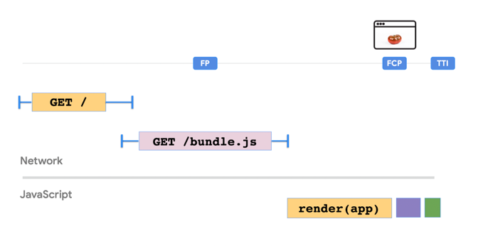

## CSR

- 자바스크립트 로직이 복잡해지면서 FCP, TTI가 증가함
### 장점
- 대부분 로직은 클라이언트에서 실행
- 전체 웹어플리케이션은 첫 요청에서 로드됨
- 유저가 링크 클릭 시 서버로부터 렌더링되어 제공되는 새로운 요청은 없음
- page refresh 없이 SPA 가능
- 라우팅이 빠름
### 단점
- SEO 고려
- 성능
  - 첫번째 페이지 로딩 시 시간이 오래걸림
- 데이터 패칭
  - 사용자 인터렉션에 따라 데이터를 패치해오므로 loading 상태 존재
### 향상하기 위해
- preloading
  - 중요한 리소스는 프리로드
  - `<link rel="preload" as="script" href="critical.js">`
- lazy loading
  - 필요할때만 load시키기
- code splitting
  - 런타임에서 다이나믹하게 로드될 수 있도록 쪼개기
- 서비스워커
  - 최소한의 html, css, js를 캐시시켜놓으므로서 오프라인에서도 사용 가능