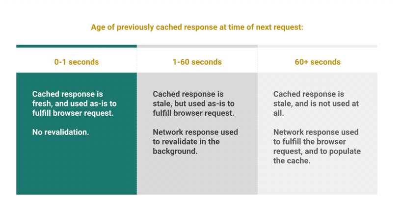

## Incremental Static Rendering
- SSG는 static한 경우에만 유용함
- 여러개의 포스트가 있는 블로그를 생각하면, 오타 하나때문에 rebuild, redeploy를 해야함
- iSSG는 이 경우에 적합함

### iSSG
- 새 페이지를 추가할 수 있음
- 존재하는 페이지를 Regeneration

### 새로운 페이지 재생성
- 새 페이지가 첫 요청시 만들어짐
- 클라이언트에서는 fallback, loader가 돌아감
- ssg에서는 404페이지가 보임
- fallback: true를 통해 지정한 ui가 보임(e.g spinner)
- revalidate, update하게 expiration time을 설정할 수 있음

### 기존 페이지 업데이트
- 존재하는 페이지를 re-render하기 위하여, 적절한 timeout이 정의되어야 함
- iSSG는 stale-while-revalidate방식을 사용하여 최신 상태를 유지함

```
// This function runs at build time on the build server
export async function getStaticProps() {
  return {
    props: {
      products: await getProductsFromDatabase(),
      revalidate: 60, // This will force the page to revalidate after 60 seconds
    }
  }
}

// The page component receives products prop from getStaticProps at build time
export default function Products({ products }) {
  return (
    <>
      <h1>Products</h1>
      <ul>
        {products.map((product) => (
          <li key={product.id}>{product.name}</li>
        ))}
      </ul>
    </>
  )
}
```
- 60초마다 재생성되므로, 먼저 서빙된 후 1분 뒤에는 새로운 정적페이지가 서빙됨

### iSSG 장점
- site rebuild없이 최신 데이터를 보여줄 수 있음
- 렌더링을 백그라운드에서 진행하기 때문에 빠름
- regeneration이 실패해도 오래된 버전을 보여줄 수 있음
- 부하가 적음
- CDN 사용