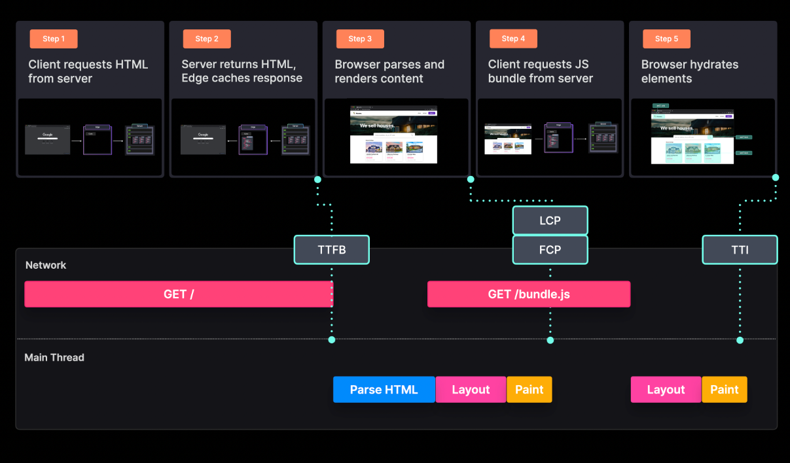
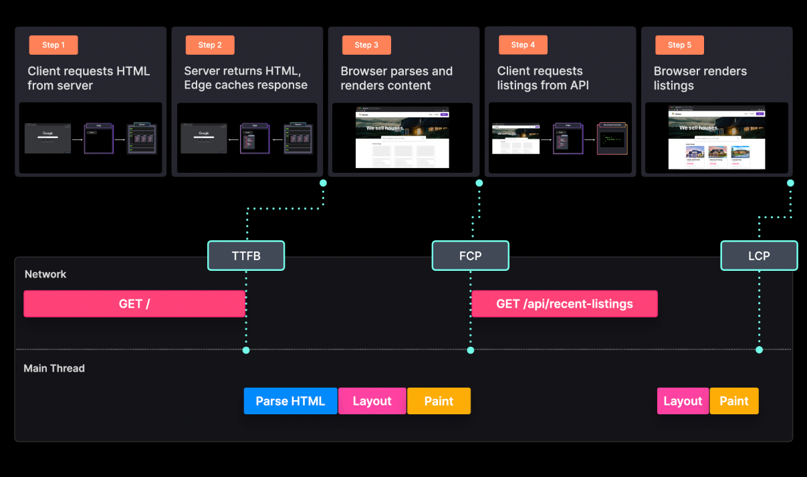
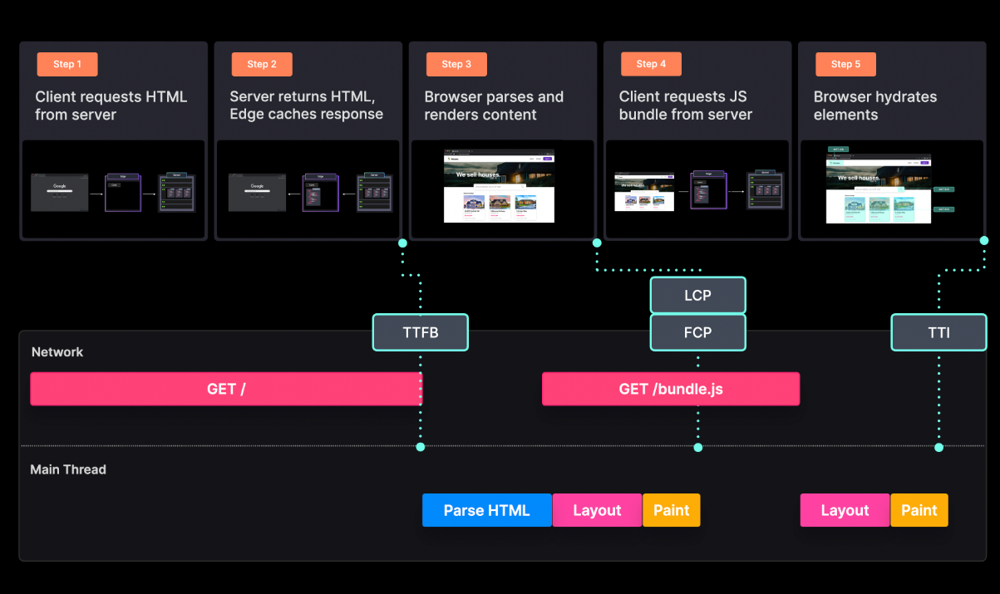
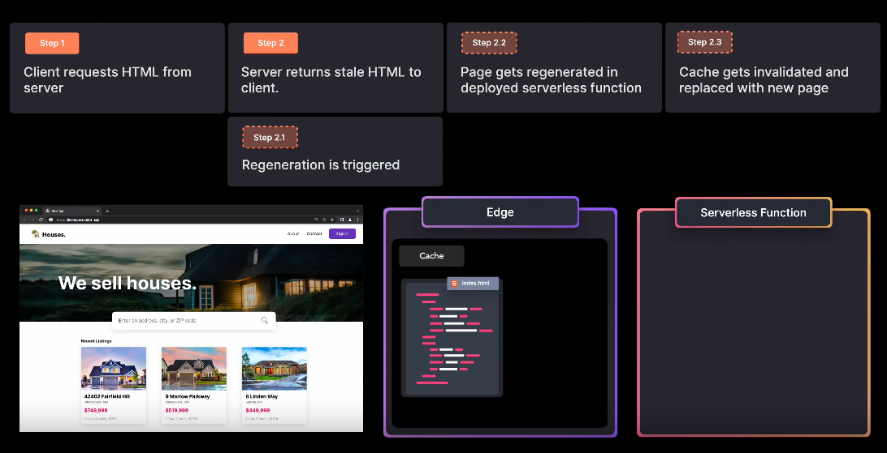
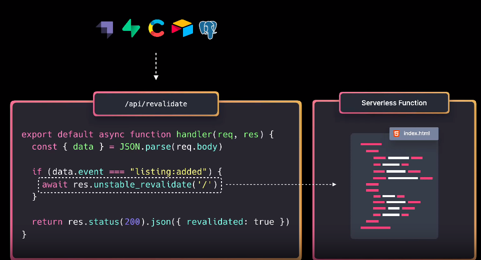
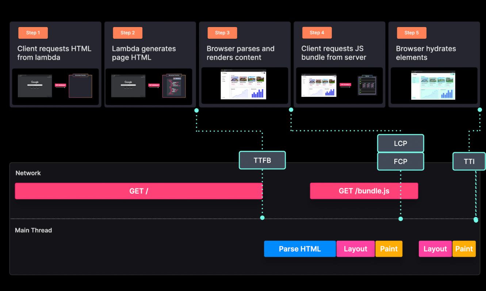

## Introduction

### 렌더링 - 성능의 주요 지표
- TTFB: Time To First Byte - 링크 클릭과 해당 사이트의 첫 바이트를 받기까지의 시간
- FP: First Paint - 사용자가 어떤 컨텐트를 보게 되거나 화면에 약간의 픽셀이 그려지기까지의 시간
- FCP: First Contentful Paint - 페이지 컨텐츠의 일부가 화면에 렌더링될 때 까지의 시간
- LCP: Largest Contentful Paint - 메인페이지의 컨텐츠가 보여지기까지의 시간, 뷰포트 내에 큰 이미지나 텍스트가 보여짐을 의미
- TTI: Time to Interactive - 페이지에 인터렉션이 가능해지기까지의 시간, 예를 들면 이벤트 핸들러들이 모두 바인딩되는 등
- TBT: Total Blocking Time - FCP부터 TTI까지의 시간

### Static Rendering
- 전체 HTML은 빌드타임에 생성되고, 다음 빌드까지 바뀌지 않음
- CDN or Edge network에 있어서 캐시 가능

### Basix/Plain Static Rendering

### Static Rendering with Client-Side `fetch`

### Static with `getStaticProps`

- 빌드 시 데이터 가져올 수 있음
- 사이트의 규모가 커질 경우 빌드시간이 커지고 외부 api 사용하는 경우 과금 많이 됨

### Incremental Static Regeneration

- 특정 static page는 pre-render하고, 유저가 요청할 때 dynamic page를 렌더링함
- 빌드시간 단축, 자동으로 캐시 무효화 및 재생성
- getStaticPaths: 동적라우팅과 getStaticProps를 사용할 경우 getStaticPaths에 의해 구체화된 모든 path를 pre-render
- fallback: 빌드 타임에 생성해놓지 않은 path로 요청이 올 경우
  - false: 404 페이지
  - true:
    - 빌드타임에 HTML로 렌더링
    - fallback을 보여주고
    - 요청이 오는 것에 따라 정적 페이지 추가
  - blocking:
    - fallback을 보여주지 않음
- revalidate
  - 캐시를 자동으로 무효화해서 특정 간격으로 백그라운드에서 페이지 재생성
- [참고](https://velog.io/@seungchan__y/NextJS%EC%99%80-ISR)

### On-demand Incremental Static Regeneration

- 필요할때만 Revalidation을 진행하여 업데이트 시기를 효율적으로 설정

### Server Side Rendering

- 모든 요청에 대해 HTML을 생성
- 요청마다 서버리스한 함수를 호출하기 때문에 비용이 많이 들 수 있음
  1. getServerSideProps 실행 시간이 적어야함
  2. serverless 함수와 같은 region에 database 배포
  3. Cache-control header를 response에 추가
  4. Server 장비 업그레이드
  
### Edge SSR + HTTP Streaming
- Edge: 사용자에게 가장 가까운 네트워크 주변부
- [HTTP Streaming](https://beta.nextjs.org/docs/data-fetching/streaming-and-suspense)