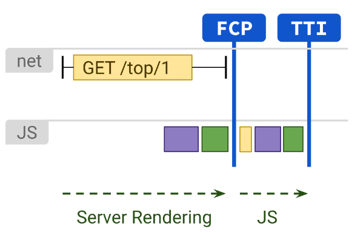

## ssr
- connect, fetch 작업은 server에서 처리
- 데이터패칭, 템플릿을 위한 부가적인 여정을 거치지 않음

### 장점

- FCP,TTI를 고속화
- SEO 지원

### 단점
- 느린 TTFB
- 전체 페이지 reolad 필요

### Next
- getServersideProps

### React
- RenderToString