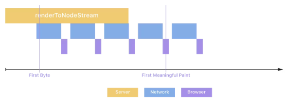

### streaming
- renderToNodeStream 메서드 사용
- renderToString를 사용하여 서버에서 렌더링 하는 경우, 메타데이터 로드 및 처리를 하려면 모든 데이터를 수신해야 함
- renderToNodeStream을 사용하면 앱 구성요소에서 데이터 청크를 수신하면서 처리 가능
- HTML 청크가 생성될 때 노드 서버에서 클라이언트로 스트리밍 됨

### island
- 정적영역은 순수 HTML, hydrate가 필요하지 않음
- 동적영역은 HTML과 hydrate script 조화