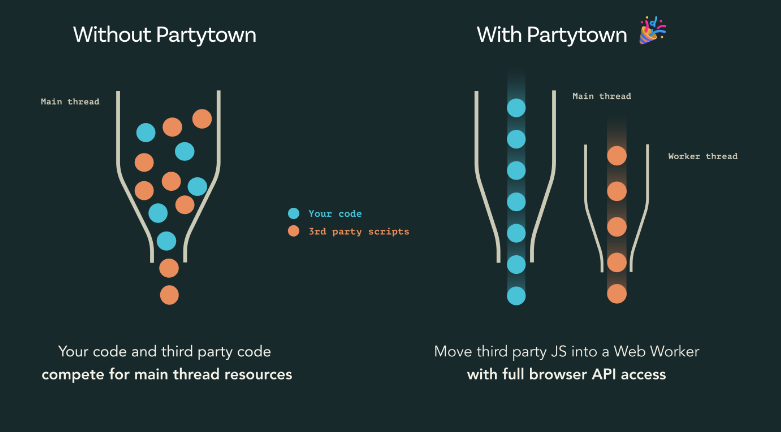
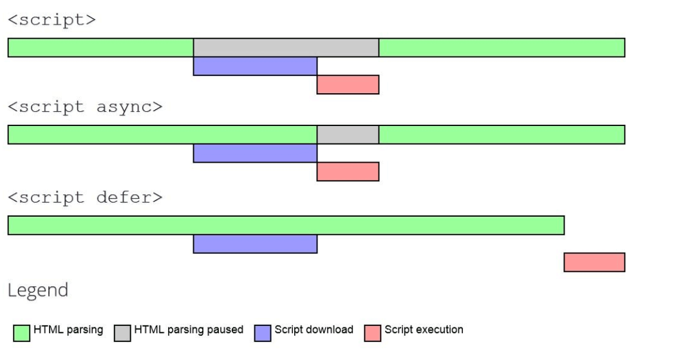

## 개요
- 서드파이 라이브러리를 로드하며 발생하는 성능 감소 최소화
- Next Script나 Partytown을 사용할 수 있음
- 
- 3p는 다음의 경우 사이트의 속도를 늦출 수 있음
  - 추가적인 라운드 트립 발생
  - 이미지나 비디오로 인해 리소스의 크기 늘어남

### 3p 리소스의 성능 영향도 평가
- lighthouse 검사

### 최적화 전략
- 대체하거나 제거
- 로딩 순서를 최적화 

### 효율적으로 로드
- async, defer를 사용하여 스크립트가 다른 컨텐츠를 차단하지 않도록 하기
  - async와 defer는 로딩 우선순위를 낮추어 나중에 로드 함
  - defer: DOM 생성 전까지 스크립트의 실행을 지연
  - async: 다운로드 즉시 메인 스레드를 블록하며 실행
  

- dns-prefetch, preconnect
  - dns-prefetch를 하면 DNS조회가 일찍 수행
  - preconnect는 매우 중요한 리소스에 대해 사용, TCP RT과 TLS를 처리하고 DNS 조회도 진행

- 지연 로딩
  - iframe loading=lazy

- Nextjs
  - Script component
    - beforeInteractive: 페이지 상호작용이 가능해지기 전에 실행되어야 하는 중요 스크립트에 적용
    - afterInteractive: 페이지 상효작용이 가능해진 후 브라우저가 실행할 수 있는 스크립트에 사용. 기본값
    - lazyOnload: 브라우저가 유휴 상태일 때 느리게 로드될 수 있는 스크립트에 사용
  - polyfill: beforeInteractive
  - media dlaqpem: lazyOnload
  - 로드 시점에 조건부로 코드 실행
    <Script strategy="beforeInteractive" onLoad={} />
  - 스크립트 내에서 인라인 스크립트 사용
    <Script>{`document.getElementById('banner').removeClass('hidden')`}